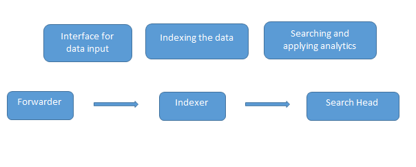
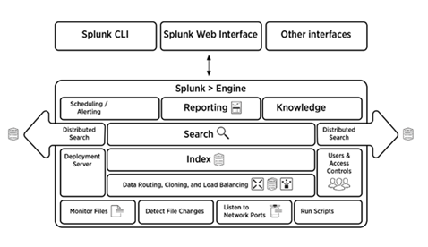
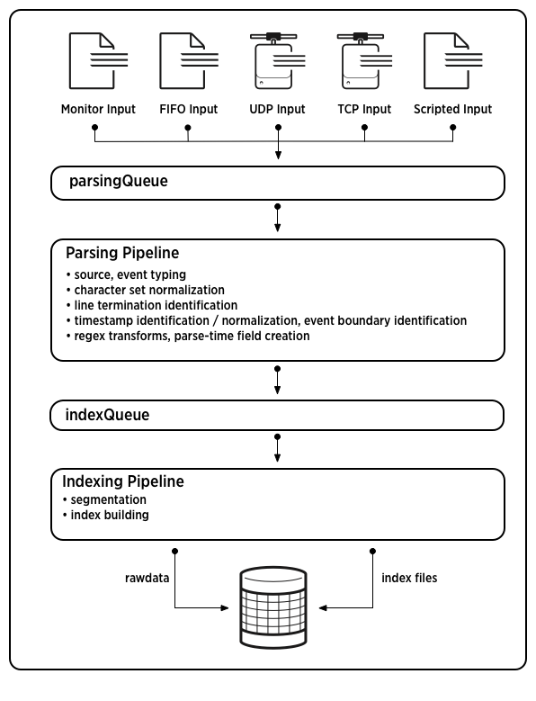
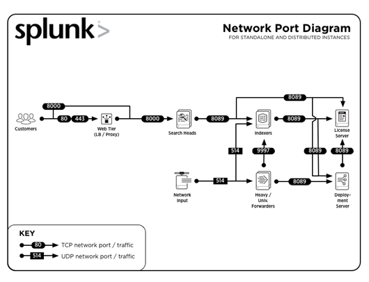
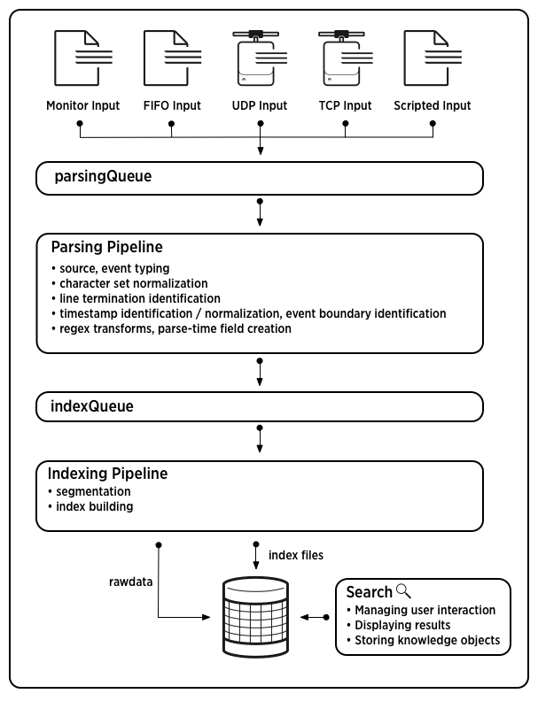
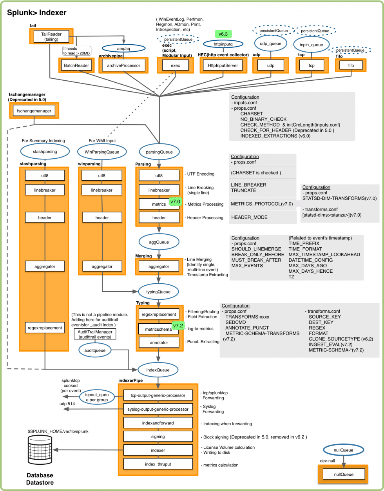

# Readings: Message Splunk
[Splunk Docs](https://docs.splunk.com/Documentation)
[Splunk vs Tableau](https://www.educba.com/splunk-vs-tableau/)
[Splunk Interview Questions](https://www.educba.com/splunk-interview-questions/)

## Explain Splunk in one sentence:  

[Splunk in one sentence](https://www.splunk.com/en_us/blog/tips-and-tricks/explaining-splunk-in-one-sentence-part-1.html)

**Google for IT data**

## What is splunk? What problems does it solve?

Splunk processes and extracts machine data and returns it in a human readable format.

It can be thought of as a Google for your log files.

Machine data (such as that generated by errors) is generated on a massive scale that is difficult to keep track of.  The data is formatted in a way that is non-intuitive to human users and is difficult to parse through.  The three main issues with machine data:
1. Complex to understand
2. Unstructured format
3. Difficult to analyze

Splunk is a tool that understands machine data and helps users identify how, where, and when the hardware/software has failed.  

## List some use-cases for Splunk:

- **Application Monitoring:** This can be used to monitor applications in real-time with configured alerts which will notify the admins/users when an application crashes.
- **Physical Security:** In the event of a flood /volcanic etc the data can be used to draw insights if your organization is dealing with any such data.
- **Network Security:** You can create a secure environment by blacklisting the IP of unknown devices thereby reducing data leaks in any organization.
- **Employee Management:** Employee attrition is one of the challenges that is faced by any organization and during notice period the employee’s activity can be tracked in order to protect the organization’s data thereby monitoring their activity and restricting any other employee in notice period not to do the same.

## What are some other products similar to Splunk? What are the advantages and disadvantages to each?

 - **ELK/Logstash** - Elasticsearch is used for searching it’s like the search head in Splunk, Log stash is for data collection which is similar to the forwarder used in Splunk, and Kibana is used for data visualization(search head does the same in Splunk)

- **Graylog (open source with commercial version)** - Graylog is yet another tool that was named last year with its release 1.0. Similar to ELK stack Graylog also has different components it uses Elasticsearch as its core component but the data is stored in Mongo DB and uses  Apache Kafka. It has two versions one core version which is available for free and the enterprise version which comes with functions like archiving.

- **Sumo Logic** -
- **QlikView** -
- **Salesforce** -
- **Insightech** -
- **Quill Engage** -
- **Cloud9** -
- **Sisense** -
- **DataMeer** -


## How does Splunk work? What is its basic architecture?

There are four components in the Splunk architecture. They are:

- **Indexer:** Indexes machine data
- **Forwarder:** Forwards logs to index
- **Search head:** Provides GUI for searching
- **Deployment server:** Manages the Splunk components(indexer, forwarder and search head) in a distributed environment

Data is loaded into Splunk using the forwarder which acts as an interface between the Splunk environment and the outside world, then this data is forwarded to an indexer where the data is either stored locally or on a cloud. The indexer indexes the machine data and stores it in the server. Search Head is the GUI which is provided by Splunk for searching and analyzing (searches, visualizes, analyzes, and performs various other functions) the data.
Deployment server manages all the components of Splunk like indexer, forwarder, and search head in Splunk environment.




## Briefly explain the indexing process.  Does Splunk use a relational or a non relational db for indexes?
[Splunk docs: how indexing works](https://docs.splunk.com/Documentation/Splunk/6.5.2/Indexer/Howindexingworks)

Splunk uses a proprietary data store called an index which consists of raw files. It is nothing like a conventional DB. Here is a good explanation of what an index is and how Splunk stores data:
http://docs.splunk.com/Documentation/Splunk/6.6.0/Indexer/Howindexingworks

Here is a good explanation of how data is stored in the index:
http://docs.splunk.com/Documentation/Splunk/6.6.0/Indexer/HowSplunkstoresindexes

MongoDB is used by Splunk to facilitate certain internal functionality like the kvstore but is by no means where data is stored as it is ingested from Universal Forwarders etc. Data that is ingested from external sources all goes to an index as specified in your configuration.



## What are Splunk buckets? Explain the bucket lifecycle?

The directories in which the indexed data is stored is known as Splunk buckets and these have events of a certain period. The lifecycle of Splunk bucket includes four stages hot, warm, cold, frozen and thawed.

- **Hot:** - This bucket contains the recently indexed data and is open for writing.
- **Warm:** - After the data falls in hot bucket depending on your data policies it moves to warm buckets
- **Cold:** - The next stage after warm is the cold stage wherein the data can’t be edited.
- **Frozen:** - By default the indexer deletes the data from frozen buckets but these can also be archived.
- **Thawed:** - The retrieval of information from archived files (frozen buckets) is known as thawing.

## Common Port numbers used by Splunk?

Service	Port Number
Management / REST API	8089
Search head / Indexer	8000
Search head	8065, 8191
Indexer cluster peer node / Search head cluster member	9887
Indexer	9997
Indexer/Forwarder	514




## What is the difference between Splunk and Tableau?

## What is the difference between structured and unstructured data?

- Structured data is clearly defined and searchable types of data, while unstructured data is usually stored in its native format. 
- Structured data is quantitative, while unstructured data is qualitative.
- Structured data is often stored in data warehouses, while unstructured data is stored in data lakes.
- Structured data is easy to search and analyze, while unstructured data requires more work to process and understand.  
- Structured data exists in predefined formats, while unstructured data is in a variety of formats. 

## How does data move through splunk?



Splunk has three main tiers: 
1. input ( a forwarder)
2. indexing (an indexer)
3. search management (a search head)

The **Forwarder** is a part of the input tier and handles the **input** phases of the data pipeline.  In the input phase, we collect the raw machine data and perform minimal, if any, processing to it.  Splunk breaks the data into 64k blocks and annotates each block with metadata keys.

Next in the datapipeline, the data is sent to the **Indexer** which manages the **parsing** and **indexing** segments of the data pipeline.  During the parsing segment, Splunk performs all processing requested by the user to transform the raw machine data into a form more useful for the user.  Then, the data is sent to the indexing segment where it is transformed into searchable events.  Each event is given a timestamp, host, source, and source type.  Here is an example of a Splunk event:

```
172.26.34.223 - - [01/Jul/2017:12:05:27 -0700] "GET /trade/app?action=logout HTTP/1.1" 200 2953
```
It is during this step that events are broken into segments that can then be searched upon by the search head.  

These events are then stored in an Index (which is like a repo) and placed into a bucket (which is like a subdirectory within that repo).

Events keep getting placed into a 'hot' bucket until it reaches a user defined size.  This prevents your buckets from becoming huge, monsterously large files.  Once the bucket is full of events, it's marked as 'warm' and splunk starts filling a new bucket.  After a set time, a bucket is marked as 'cold'. 'Hot' and 'warm' buckets can be written to, 'cold' buckets can only be read.

The events in these buckets are stored as two files: rawdata and index files.  The **rawdata** file contains the actual event data as well as journal information that the indexer can use to reconstitute the index’s index files.  The **index file** contains all the metadata that the indexer uses to search the events stored in the rawdata files.  A bucket without index files is not searchable.  


The last step involves the **Search Head**  The search head is the GUI that handles the final segment of the data pipeline, the **search segment**.  In this segment the user is able to query the events stored in the indexes and return them in the format of their choice. Splunk's search head allows users to calculate metrics, generate reports, filter by specific conditions, as well as use machine learning to identify patterns and predict future trends.  

Splunk uses an in house language called Search Processing Language (SPL) to query events.  It is based upon SQL and includes data searching, filtering, modification, manipulation, insertion, and deletion.

## What are the different segments of the data pipeline?

- Input
- Parsing
- Indexing
- Search

## How many processing tiers does splunk use, and which data pipeline segments are each responsible for?
- The data input tier handles the input segment.
- The indexing tier handles the parsing and indexing segments.
- The search management tier handles the search segment.


## What is parsing? When/where is it performed?
Parsing is the second segment of the data pipeline.   This is also known as event processing.  Data arrives at this segment from the input segment.  This segment is where even processing occurs and where Splunk analyzes and transforms raw machine data into a more readable format.  Parsing can occur on either an indexer or a heavy forwarder. 

It is during this phase that Splunk software breaks the data stream into individual events.The parsing phase has many sub-phases:

- Breaking the stream of data into individual lines.
- Identifying, parsing, and setting timestamps.
- Annotating individual events with metadata copied from the source-wide keys.
- Transforming event data and metadata according to regex transform rules.

## What is the input segment? When/where is it performed?
In the input segment, Splunk software consumes data. It acquires the raw data stream from its source, breaks it into 64K blocks, and annotates each block with some metadata keys. The keys apply to the entire input source overall. They include the host, source, and source type of the data. The keys can also include values that are used internally, such as the character encoding of the data stream, and values that control later processing of the data, such as the index into which the events should be stored.

During this phase, Splunk software does not look at the contents of the data stream, so the keys apply to the entire source, not to individual events. In fact, at this point, Splunk software has no notion of individual events at all, only of a stream of data with certain global properties.

After data has been acquired and split into blocks, it moves to the next segment of the pipeline, parsing.

Data input can occur on either an indexer or a forwarder.

## What is the index segment? When/where is it performed?

[How indexing works](https://wiki.splunk.com/Community:HowIndexingWorks)

During indexing, Splunk software takes the parsed events and writes them to the index on disk. It writes both compressed raw data and the corresponding index files.

For brevity, parsing and indexing are often referred together as the indexing process. At a high level, that makes sense. But when you need to examine the actual processing of data more closely or decide how to allocate your components, it can be important to consider the two segments individually.

## What is segmentation? When/where is it performed?
[about segmentation](https://docs.splunk.com/Documentation/Splunk/8.0.6/Data/Abouteventsegmentation)
Segmentation breaks events up into searchable segments at index time, and again at search time. Segments can be classified as major or minor. Minor segments are breaks within major segments. For example, the IP address 192.0.2.223 is a major segment. But this major segment can be broken down into minor segments, such as "192", as well as groups of minor segments like "192.0.2".

A searchable part of an event. Splunk Enterprise breaks events into segments, a process known as "segmentation," at index time and at search time.???

**segmentation allows you to define how you want your stored events, in our case error messages, to be searchable.  So for example, we could tell splunk to segment out '500' level error codes so we can search our database by those specific error codes**


## What do indexer clusters do?  Why is data replicated?


## How does the indexer store indexes?

## What are Splunk buckets? Explain the bucket lifecycle?

Splunk buckets are subdirectories stored in indexes that contain event data.  Event data is broken into rawdata, which contains the event info and index files, which contains metadata that allows users to search through the events. 

# Vocabulary Terms

- **unstructured data** - undefined, unsearchable data that exists in no defined format.  Qualitative.
- **structured data** - clearly defined, searchable data that exists in a predefined format.  It is quantative as opposed to qualitative.
- **BI Software** - Business Intelligence software.  Any software used to extract, analyze, transform data as per need and report for business intelligence purposes. 
- **MTTR** - Mean Time To Repair
- **Knowledge Object** - Knowledge objects are the way Splunk gives form to the chaos of raw data. They are how you can create a multi-dimensional data structure that enables you to infer meaning and actionable insights from a steady stream of raw data.Fields, searches, and reports are all examples of knowledge objects. [How to Create a Report](https://www.youtube.com/watch?v=L-CnmXEXIug)
[What are Knowledge Objects?](https://community.splunk.com/t5/Archive/What-are-knowledge-objects-and-what-do-I-need-to-know-about-them/td-p/475886)
- **Search Factor (SF)** - The number of searchable copies of data that an indexer cluster maintains. The default value of the search factor is 2.
- **Replication Factor (RF)** - the replication factor is defined as the number of copies of data that the cluster maintains. Indexer cluster has both a Search Factor and a Replication Factor whereas Search head cluster has only a Search Factor
- **Forwarder** - Collects data and forwards it to other splunk instances
- **Indexer** - Organizes and stores the forwarded data.  A Splunk Enterprise instance that indexes data, transforming raw data into events and placing the results into an index. It also searches the indexed data in response to search requests.  The indexer also frequently performs the other fundamental Splunk Enterprise functions: data input and search management. In larger deployments, forwarders handle data input and forward the data to the indexer for indexing. Similarly, although indexers always perform searches across their own data, in larger deployments, a specialized Splunk Enterprise instance, called a search head, handles search management and coordinates searches across multiple indexers.  The indexer is sometimes referred to by more specific terms, according to its context.
- **Search Head** - GUI interface to analyze, visualize and report the indexed data
- **Bucket** - A file system directory containing a portion of a Splunk Enterprise index.  A Splunk Enterprise index typically consists of many buckets, organized by age.
- **indexer cluster** - A specially configured group of Splunk Enterprise indexers that replicate external data, so that they maintain multiple copies of the data. Indexer clusters promote high availability and disaster recovery.
- **rawdata file** - A compressed file in an index bucket that contains event data, as well as journal information that the indexer can use to reconstitute the index’s index files. The rawdata file and the index files together constitute the files in a bucket.  In an indexer cluster, a searchable copy of a bucket contains both the rawdata file and a set of index files. A non-searchable copy contains only the rawdata file.
- **index file** - The files in an index bucket that contain the metadata that the indexer uses to search the bucket’s event data. The main index files are the tsidx files, but the bucket contains a number of other metadata files as well.  The event data itself is contained in the rawdata file. The rawdata file and the index files together constitute the files in a bucket.  In an indexer cluster, a searchable copy of a bucket contains both index files and a rawdata file. A non-searchable copy contains only the rawdata file.
- **event data** - A descriptive term for all the IT data that has been added to Splunk software indexes. The individual pieces of data are called events. Splunk software also stores information related to its own structure and processing. This includes everything that is not event data.
- **events** - A single piece of data in Splunk software, similar to a record in a log file or other data input. When data is indexed, it is divided into individual events. Each event is given a timestamp, host, source, and source type. Often, a single event corresponds to a single line in your inputs, but some inputs (for example, XML logs) have multiline events, and some inputs have multiple events on a single line. When you run a successful search, you get back events.  Similar events can be categorized together with event types.
- **index** - Splunk Enterprise stores all of the data it processes in indexes. An index is a collection of databases, which are subdirectories located in $SPLUNK_HOME/var/lib/splunk. Indexes consist of two types of files: rawdata files and index files.   The repository for data. When the Splunk platform indexes raw data, it transforms the data into searchable events.  Indexes reside in flat files on the indexer.

There are two types of indexes:

Events indexes. Events indexes are the default type of index. They can hold any type of data.
Metrics indexes. Metrics indexes hold only metric data.
verb

In general, the act of processing raw data and adding the processed data to an index.

Specifically, indexing is the third segment of the data pipeline, in which the indexer takes parsed events and writes them to the search index on disk.



